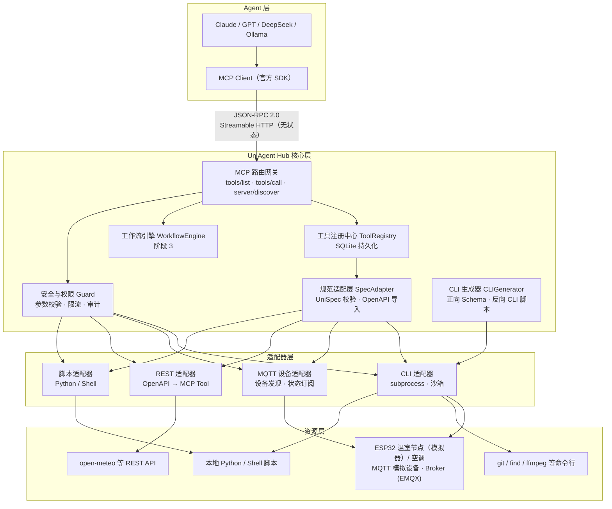
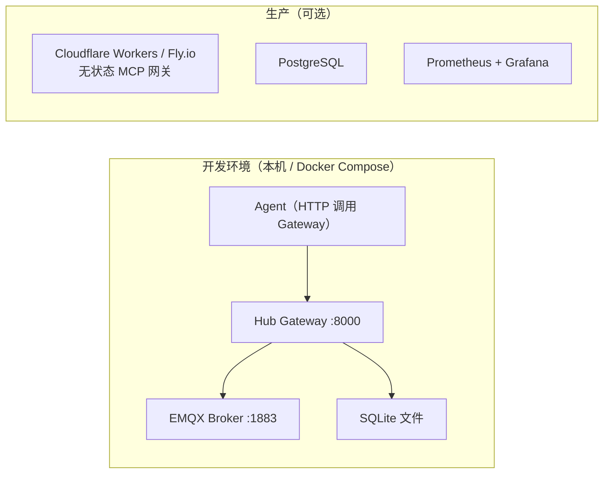

# UniAgent Hub — 架构设计文档

> 版本：v0.2 · 日期：2026-09-26（v0.1 冻结于 2026-09-25；v0.2 对齐阶段 1-3 实现）

## 1. 总体架构



## 2. 端到端数据流（唯一主链路）

```
Agent ──tools/list──▶ Gateway ──▶ Registry（读工具列表）
Agent ──tools/call──▶ Gateway ──▶ Guard 管道 ──▶ 适配器 ──▶ 资源
                          │            │
                          │            ├─ 1. 存在性检查（1001）
                          │            ├─ 2. 权限校验（1003，能力级粒度）
                          │            ├─ 3. 限流（1004，tool×caller×scope 三维）
                          │            ├─ 4. 参数校验 + 注入拦截（1002/1007）
                          │            └─ 5. 审计落盘（含被拦截请求的完整 args）
                          └──▶ 结果 + trace_id ──▶ SQLite + JSONL 审计
```

**关键不变式**：Agent 永远只与 Gateway 对话，绝不直接接触适配器或资源。

## 3. 模块职责

| 模块 | 职责 | 关键技术 |
|---|---|---|
| MCP Gateway | 唯一入口；工具发现、路由、协议协商 | FastAPI + 自研 JSON-RPC 2.0 路由（无 MCP SDK 依赖，零依赖可控） |
| ToolRegistry | 存储 UniSpec、权限、日志 | SQLite（WAL，dev/prod 单机）/ PostgreSQL（集群，规划中） |
| SpecAdapter | UniSpec 校验、OpenAPI 导入转换 | Pydantic v2 + 自研 OpenAPI 最小解析器 |
| Guard | 参数校验、命令注入防护、权限、限流、审计 | 自研校验器 + 滑动窗口限流 + SQLite/JSONL 双写审计 |
| WorkflowEngine | 多工具编排，一次 `run_workflow` | Kahn 拓扑排序 + 自研安全表达式解析器（零 eval） |
| CLIGenerator | CLI 命令模板 ⇄ MCP Tool 双向生成 | 自研模板引擎 |

## 4. 关键设计决策（ADR 摘要）

### ADR-1 无状态网关
2026-07-28 MCP 规范采用无状态核心，`initialize` 握手已移除。网关不保存会话状态，可直接水平扩展与负载均衡（round-robin），且可部署 Serverless。

### ADR-2 适配器模式
每种资源类型一个适配器，统一实现 `discover() / list_tools() / call_tool()` 三方法。新增资源类型 = 新增适配器，核心层零改动。

### ADR-3 安全横切与管道顺序
所有 `tools/call` 强制经过 Guard 管道：**存在性 → 权限 → 限流 → 参数校验 → 适配器执行 → 审计**。安全不是某个模块的职责，而是调用链上的必经关卡。

**为什么限流先于参数校验（设计说明，非缺陷）**：
1. **限流是资源保护**，必须尽早执行 —— 若先做 Schema 校验，恶意高频请求会持续消耗校验计算资源，本身构成 DoS 攻击面；先限流把成本锁在 O(1) 滑动窗口检查；
2. **拦截效果等价** —— 参数非法的请求无论被 1002（校验失败）还是 1004（限流）拒绝，都不会到达资源层，拦截率均为 100%；
3. **审计不丢信息** —— 被拦截请求的完整 args 仍会写入审计日志（含 block_reason），事后安全分析不受影响；
4. 权限置于限流之前：无权限调用直接拒绝，不占用合法调用者的限流配额维度判定。

（配套工程实践：安全测试用例使用独立 `caller` 标识或预先重置限流桶，避免测试自身触发限流污染断言。）

### ADR-4 CLI 执行不使用 shell
`subprocess.run(argv, shell=False)`，参数经正则白名单校验。杜绝 `; rm -rf` 类注入。此决策贯穿所有 CLI/脚本适配器。

### ADR-5 先 CLI 后 IoT/REST
CLI 适配器无外部依赖、最容易端到端验证，作为 MVP 首发；MQTT 先用 Python 模拟器；REST 最后。

### ADR-6 协议与 Agent 栈（自研网关为默认/回退，FastMCP 4 为兼容双协议前端）
1. **网关自研 JSON-RPC 2.0 路由**（零 MCP SDK 依赖）：为完全控制协议行为并验证对规范的理解，
   自研实现 `server/discover`（双版本协商 2026-07-28 / 2025-11-25）、`initialize` 旧协议回显、`ping`、
   `tools/list`、`tools/call`。相比直接封装 FastMCP 4，自研路径可逐字节控制协议版本协商与错误码语义；
   改进方案第 1 批后，FastMCP 4 作为**兼容前端**（`--gateway fastmcp`，双协议前端之一）：
   协议层交给 FastMCP（streamable HTTP，客户端连 `http://host:port/mcp`），执行/安全/审计仍走
   自研网关；`selfdev`（自研）为默认与回退路径，两条前端执行语义一致；
2. **Agent 层自研**（OpenAI 兼容接口可插拔 + 三级降级链：原生 tool_calls → 提示词 JSON 计划 → 确定性脚本模式），
   保证在线/离线/无 LLM 三种环境下均可演示 —— 安全与可用性不依赖特定 Agent 框架；
3. **全 Python 单栈**（未引入 TypeScript CLI 工具链）：降低部署复杂度、单机单解释器即可跑通全链路，
   TypeScript 工具链列为未来扩展方向；
4. **存储与可观测性轻量化**：SQLite WAL（生产切换 PostgreSQL 的路径已预留）+ structlog 结构化日志 +
   审计 Web Dashboard，替代 Redis/NATS/PostgreSQL/Prometheus/Grafana 重栈 —— 演示期零额外部署。

### ADR-7 五类适配器（含数据库）
CLI / MQTT / REST / 脚本四类之外，B9 批次新增**数据库适配器**（SQLite 只读查询 + 受限写，
动词白名单 + 单语句 + 独立演示库），使"一规范多类型"覆盖到第五类资源。
WebSocket 适配器列为**规划**（改进路线批 5），即「已实装 5 类 + 规划 1 类」。

## 5. 传输与部署拓扑



- **传输**：`Streamable HTTP`（默认，无状态，无需 sticky session，可直接水平扩展）；
  `stdio` 传输为未来扩展预留（UniSpec `protocol` 枚举已含 `stdio` 位，本阶段未实现）；
- **内存预算（设计目标，未实测）**：Hub 约 300MB，EMQX 约 200MB，Agent 视模型而定，总计 < 1.5GB
  （本机 Docker 引擎不可用，Compose 部署形态的内存占用尚未验证）。

## 6. 协议版本兼容

| 客户端规范 | 处理方式 |
|---|---|
| 2026-07-28（无状态） | 原生支持（默认） |
| 2025-11-25（有状态 initialize） | `server/discover` 返回 `supportedVersions` 供客户端协商 |

实现方式：自研轻量 JSON-RPC 2.0 路由（无 MCP SDK 依赖），`server/discover` 响应
携带 `protocolVersion`（当前协商版本）与 `supportedVersions`（兼容版本列表），
客户端按需选择；无状态核心使网关可直接水平扩展。

## 7. 可观测性

- **日志**：结构化输出，关键字段 `trace_id / tool_name / caller / latency_ms / result`；
- **审计**：SQLite `audit` 表 + `data/audit.jsonl` 双写（记录含 `guard_result` 与数字 `error_code`，A2），阶段 3 Web 界面（`web/audit_dashboard`）支持按 caller/工具/错误码筛选（1007/1003/1004 可直接检索）；
- **指标（可选）**：Prometheus 计数器（调用次数、错误率、延迟分布，规划中）。

## 8. 扩展能力与安全批次（2026-10-04）

### 8.1 元工具（渐进式发现）
`--meta-tools` / `HUB_META_TOOLS=1` 开启后，`tools/list` 仅返回 4 个元工具：
`discover_tools` / `get_tool_schema` / `execute_tool` / `refresh_registry`；
`execute_tool` 透传完整 Guard 管道（1001/1002/1003/1004/1007 语义与 `tools/call` 一致）。
默认关闭（返回全量列表，演示链路不受影响）。

### 8.2 Schema 签名 / 审计哈希链
- **工具清单签名**：工具定义（name/description/inputSchema）SHA-256 内容哈希 + 可选 Ed25519 签名
  （`HUB_ATTESTATION_KEY`）；`server/attestation` RPC 与 `scripts/attestation.py`；审计记录默认携带 `schema_hash`；
- **审计哈希链**（`HUB_AUDIT_CHAIN=1`）：逐条 `rec_hash` 链接，`verify_chain` 可检出篡改并定位到条。

### 8.3 温室模拟节点（ESP32 软件在环 SIL）
`adapters/mqtt_adapter/sim_esp32_greenhouse.py`（设备 id `irrigation_01`）以 MQTT 模拟器注册
3 个工具（`get_soil_moisture` / `get_light_intensity` / `control_pump`），配合工作流 `smart_irrigation`
（读土壤湿度 → 读光照 → 条件开泵）验证浇水闭环；真机固件为后续可选轨。

### 8.4 Bearer Token 中间件
网关默认监听 `127.0.0.1`；设置 `HUB_API_TOKEN` 后，`/mcp` 与 `/workflows/recent` 需携带
`Authorization: Bearer <token>`（401=未授权，JSON-RPC 错误码 -32001）。鉴权开启时权限由
服务端裁决（认证=admin、未认证=read；客户端 `permission_level` 仅作提示）。
